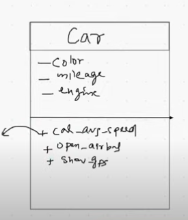
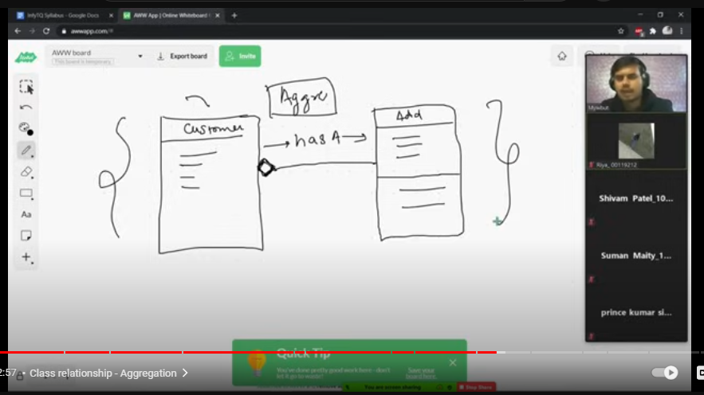

# OOP in Python 

## General Concepts
- Everything in Python is an object
- Generality to specificity
  1. Object
  2. Class
  3. Abstraction
  4. Inheritance
  5. Encapsulation
  6. Polymorphism

## Class and Object
- **Class**: 
  - `a = 2` is an object of the integer class.
  - Datatype is the class.
  - Making a class is time-consuming.
  - Class is a blueprint of how an object behaves.
  - Consists of data and functions.
  - PascalCase, camelCase, snake_case.
  - Class in PascalCase and methods or functions in snake_case, that's the notation.
  - 
  - Python provides object literals for built-in classes.
  - Methods are functions written inside a class.
  - `l.append` is a method of list class and `len(l)` is a function as it doesn't belong to any class.
  - To declare variables inside a class we need to define them inside a method `__init__`.
  - To create your own methods that you can import, you need to keep them inside the library folder of Python.
  - Some methods are magic methods, special methods, dunder methods, and constructor is one of them.
  - [dunder methods](https://docs.python.org/3/reference/datamodel.html#special-method-names)
  - Magic methods are called automatically, we don't need to call them.
  - We keep the configuration settings in the constructor method like connecting to the internet which shouldn't have the control to the user.
  - `self` is the same thing as the object created i.e. `hdfc`.
  - When a method is called, the default input is the object itself, so `self` is provided.

### Example
```python
class Person:
    def __init__(self, name, age):
        self.name = name
        self.age = age

    def introduce(self):
        return f"Hi, my name is {self.name} and I am {self.age} years old."

# Creating objects
person1 = Person("Alice", 25)
person2 = Person("Bob", 30)

# Accessing properties and methods
print(person1.introduce())  # Output: Hi, my name is Alice and I am 25 years old.
print(person2.introduce())  # Output: Hi, my name is Bob and I am 30 years old.
```

## Encapsulation
- Instance variables are the variables declared inside a constructor.
- Value is different for all objects.
- Access modifiers are words that you put before data like private, public, static, etc.
- Put `__` before a variable to make it private.
- Nothing in Python is truly private.
- `_Atm__pin` is the variable name after being called by the object so we can modify the variable directly.

### Example
```python
class BankAccount:
    def __init__(self, account_number, balance):
        self.__account_number = account_number  # Private attribute
        self.__balance = balance

    def get_balance(self):  # Getter method
        return self.__balance

    def deposit(self, amount):
        if amount > 0:
            self.__balance += amount
            print(f"Deposited {amount}. New balance is {self.__balance}.")
        else:
            print("Deposit amount must be positive.")

    def withdraw(self, amount):
        if 0 < amount <= self.__balance:
            self.__balance -= amount
            print(f"Withdrawn {amount}. Remaining balance is {self.__balance}.")
        else:
            print("Invalid withdrawal amount.")

# Example usage
account = BankAccount("12345", 1000)
account.deposit(500)
account.withdraw(300)
print(account.get_balance())  # Output: 1200
```

## Inheritance
- Inheritance allows a class (child) to acquire the properties and methods of another class (parent).

### Example
```python
class Vehicle:
    def __init__(self, brand, model):
        self.brand = brand
        self.model = model

    def display_info(self):
        return f"{self.brand} {self.model}"

class Car(Vehicle):  # Inherits from Vehicle
    def __init__(self, brand, model, doors):
        super().__init__(brand, model)  # Call parent constructor
        self.doors = doors

    def display_info(self):
        return f"{super().display_info()} with {self.doors} doors."

# Example usage
car = Car("Toyota", "Corolla", 4)
print(car.display_info())  # Output: Toyota Corolla with 4 doors.
```

## Polymorphism
- Polymorphism allows objects to take multiple forms, enabling methods to behave differently based on the object invoking them.

### Example
```python
class Shape:
    def area(self):
        pass

class Circle(Shape):
    def __init__(self, radius):
        self.radius = radius

    def area(self):
        return 3.14 * self.radius ** 2

class Rectangle(Shape):
    def __init__(self, length, width):
        self.length = length
        self.width = width

    def area(self):
        return self.length * self.width

# Example usage
shapes = [Circle(5), Rectangle(4, 6)]
for shape in shapes:
    print(f"Area: {shape.area()}")
```

## Abstraction
- Abstraction is the process of hiding implementation details and exposing only essential features.

### Example
```python
from abc import ABC, abstractmethod

class Animal(ABC):
    @abstractmethod
    def sound(self):
        pass

class Dog(Animal):
    def sound(self):
        return "Bark"

class Cat(Animal):
    def sound(self):
        return "Meow"

# Example usage
animals = [Dog(), Cat()]
for animal in animals:
    print(animal.sound())
```

## Association, Aggregation, and Composition
- **Association**: A general relationship between two classes.
- **Aggregation**: A weak relationship where the child can exist independently of the parent.
- **Composition**: A strong relationship where the child cannot exist without the parent.

### Example
```python
class Engine:
    def __init__(self, horsepower):
        self.horsepower = horsepower

class Car:
    def __init__(self, brand, engine):
        self.brand = brand
        self.engine = engine  # Aggregation

class Wheel:
    def __init__(self, size):
        self.size = size

class Vehicle:
    def __init__(self, brand, wheels):
        self.brand = brand
        self.wheels = wheels  # Composition

# Aggregation example
engine = Engine(150)
car = Car("Honda", engine)
print(f"{car.brand} car with {car.engine.horsepower} HP engine.")

# Composition example
wheels = [Wheel(16) for _ in range(4)]
vehicle = Vehicle("Toyota", wheels)
print(f"{vehicle.brand} vehicle with {len(vehicle.wheels)} wheels.")
```

## Reference Variable 
- `sbi` is the reference variable which stores the object created by `sbi = Atm()`.
- By pass by reference, the original value gets changed.

### Python's Behavior

- **Immutable Types**:
  - Types such as integers, strings, and tuples are immutable. When you pass an immutable object to a function, it behaves as if it is passed by value. 
  - You cannot change the original object itself; you can only reassign the reference to a new object. Therefore, changes inside the function do not affect the original object.
  
  **Example:**

  ```python
  def modify_value(x):
      x = x + 10  # This reassigns x to a new integer object

  num = 5
  modify_value(num)
  print(num)  # Output will still be 5
  ```

- Sets can only have immutable data types.

## Static Variables in Python OOP

### Definition:
- **Static Variables** (also known as class variables) are variables that are shared among all instances of a class. Unlike instance variables, which are unique to each instance, static variables have the same value for all instances of the class.

### Characteristics:
- Static variables are defined within a class but outside of any instance methods.
- They are initialized when the class is first defined.
- They are accessed using the class name or an instance of the class.

### Usage:
- Static variables are useful for storing values that should be consistent across all instances of a class.
- They can be accessed directly via the class or through an instance.

### Example
```python
class Counter:
    count = 0  # Static variable

    def __init__(self):
        Counter.count += 1  # Increment the static variable

    def display_count(self):
        print(f"Count: {Counter.count}")

# Creating instances of Counter
c1 = Counter()
c2 = Counter()
c3 = Counter()

# Displaying the count using instances
c1.display_count()  # Output: Count: 3
c2.display_count()  # Output: Count: 3

# Accessing the static variable directly from the class
print(Counter.count)  # Output: 3
```
- If you are using only static variables in a method, then name them static methods by using `@staticmethod` before every method name.

## Difference Between Method and Function

| Feature            | Method                                                                 | Function                                      |
|--------------------|------------------------------------------------------------------------|-----------------------------------------------|
| Definition         | A function that is defined inside a class and is associated with an object. | A block of code that performs a specific task and is not necessarily associated with an object. |
| Invocation         | Called on an object using the dot notation (e.g., `object.method()`).  | Called independently using its name (e.g., `function()`). |
| Binding            | Implicitly bound to an instance of the class (the `self` parameter).   | Not bound to any instance or class.           |
| Context            | Operates on data contained within the class instance.                 | Operates on data passed to it as parameters.  |
| Example            | ```python                         class MyClass:                     def my_method(self):                         print("This is a method")                     obj = MyClass()                     obj.my_method()                     ``` | ```python                     def my_function():                         print("This is a function")                     my_function()                     ``` |

## Aggregation 


- Aggregation has a relationship, inheritance is a relationship.

Class -> 
1. Data or property 
2. Methods or behavior 

- Class name should be in PascalCase.
- Variables or data should be in snake_case.
- Data in a class is generally private.
- Methods in a class are public or private.
- Private entities are generally denoted by `-` in class diagram and public stuff by `+` sign.

```python
l = [1,2,3]  # object literal given for built-in classes 
l = list()  # normal definition of calling a method 

city = str()
```

- Yes, public methods can be divided into static and non-static methods. Both static and non-static methods are accessible from outside the class, while private methods are not accessible directly from outside the class, regardless of whether they are static or non-static.

### Summary:
- **Public Methods**: Accessible from outside the class.
- **Static Methods**: Do not require an instance of the class to be called. Defined using the `@staticmethod` decorator.
- **Non-static Methods**: Require an instance of the class to be called. Defined normally with `self` as the first parameter.
- **Private Methods**: Not accessible directly from outside the class. Prefixed with a double underscore (`__`).

### Example
```python
class ATM:
    def __init__(self):
        self.__pin = None

    # Public non-static method
    def create_pin(self):
        temp = input('Enter your new PIN: ')
        self.__pin = temp
        print('PIN set successfully')
        self.__menu()  # Calling private method

    # Private method
    def __menu(self):
        print("Displaying menu")

    # Public static method
    @staticmethod
    def static_method_example():
        print("This is a static method")

    # Public non-static method
    def non_static_method_example(self):
        print("This is a non-static method")

# Example usage
atm = ATM()
atm.create_pin()  # Public non-static method
ATM.static_method_example()  # Public static method
atm.non_static_method_example()  # Public non-static method

# Trying to call the private method directly will raise an AttributeError
# atm.__menu()  # Uncommenting this line will raise an error
```


string formatting :

1. str.format()

name = "Alice"
age = 30
formatted_string = "Name: {}, Age: {}".format(name, age)
print(formatted_string)  # Output: Name: Alice, Age: 30

# With positional and keyword arguments
formatted_string = "Name: {0}, Age: {1}".format(name, age)
print(formatted_string)  # Output: Name: Alice, Age: 30

formatted_string = "Name: {name}, Age: {age}".format(name=name, age=age)
print(formatted_string)  # Output: Name: Alice, Age: 30


2.by  % operator
name = "Alice"
age = 30
formatted_string = "Name: %s, Age: %d" % (name, age)
print(formatted_string)  # Output: Name: Alice, Age: 30

Instance variables :
Instance variables are variables that are defined inside a class but outside any method. They are shared by all
instances of the class.
python
class MyClass:
# Instance variable
my_var = "Hello, World!"
# Method to print the instance variable
def print_var(self):
print(self.my_var)
# Creating an instance of the class
my_obj = MyClass()
print(my_obj.my_var)  # Output: Hello, World!
print(my_obj.print_var())  # Output: Hello, World!


access modifiers:
private public 


nothing in python is truely private , but we can use double underscore to make it look like private

ABSTRACTION:
Abstraction in OOP (Object-Oriented Programming) in Python
Abstraction is one of the fundamental principles of object-oriented programming. It involves hiding the complex implementation details and showing only the essential features of an object. This helps in reducing programming complexity and effort.

In Python, abstraction can be achieved using abstract classes and interfaces. The abc module in Python provides the infrastructure for defining abstract base classes (ABCs).


```python
from abc import ABC, abstractmethod

class Animal(ABC):
    @abstractmethod
    def sound(self):
        pass

class Dog(Animal):
    def sound(self):
        return "Bark"

class Cat(Animal):
    def sound(self):
        return "Meow"

# Example usage
dog = Dog()
cat = Cat()
print(dog.sound())  # Output: Bark
print(cat.sound())  # Output: Meow
```

Explanation:
Abstract Class (Animal): An abstract class cannot be instantiated and typically includes one or more abstract methods.
Abstract Method (sound): A method that is declared, but contains no implementation. Subclasses are required to implement this method.
Concrete Classes (Dog and Cat): These classes inherit from the abstract class and provide implementations for the abstract methods.
In this example, the Animal class is an abstract class with an abstract method sound. The Dog and Cat classes inherit from Animal and provide their own implementations of the sound method. This demonstrates how abstraction allows us to define a template for a group of related classes while hiding the implementation details.


In Python, data abstraction can be implemented in several ways beyond using abstract classes. Here are a few more methods:

1. Using Abstract Base Classes (ABCs)
As previously shown, abstract base classes (ABCs) can be used to define abstract methods that must be implemented by subclasses.

2. Using Interfaces
While Python does not have a built-in interface keyword like some other languages, you can achieve similar functionality using ABCs.

3. Using Encapsulation
Encapsulation is another way to achieve abstraction by restricting access to certain components of an object. This is typically done using private and protected members.

4. Using Properties
Properties in Python allow you to control access to instance variables, providing a way to hide the internal representation of an object.

Example Implementations
Using Abstract Base Classes (ABCs)
Using Encapsulation
Using Properties
Summary
Abstract Base Classes (ABCs): Define abstract methods that must be implemented by subclasses.
Encapsulation: Restrict access to certain components of an object using private and protected members.
Properties: Control access to instance variables, providing a way to hide the internal representation of an object.
These methods help achieve data abstraction by hiding the implementation details and exposing only the necessary parts of an object.

```python
from abc import ABC, abstractmethod

class Shape(ABC):
    @abstractmethod
    def area(self):
        pass

    @abstractmethod
    def perimeter(self):
        pass

class Rectangle(Shape):
    def __init__(self, width, height):
        self.width = width
        self.height = height

    def area(self):
        return self.width * self.height

    def perimeter(self):
        return 2 * (self.width + self.height)

# Example usage
rect = Rectangle(10, 20)
print(f"Area: {rect.area()}")  # Output: Area: 200
print(f"Perimeter: {rect.perimeter()}")  # Output: Perimeter: 60```


By abstract classes
```python
class BankAccount:
    def __init__(self, balance):
        self.__balance = balance  # Private variable

    def deposit(self, amount):
        if amount > 0:
            self.__balance += amount

    def withdraw(self, amount):
        if 0 < amount <= self.__balance:
            self.__balance -= amount

    def get_balance(self):
        return self.__balance

# Example usage
account = BankAccount(1000)
account.deposit(500)
account.withdraw(200)
print(f"Balance: {account.get_balance()}")  # Output: Balance: 1300
```


By encapsulation

```python
class BankAccount:
    def __init__(self, balance):
        self.__balance = balance  # Private variable

    def deposit(self, amount):
        if amount > 0:
            self.__balance += amount

    def withdraw(self, amount):
        if 0 < amount <= self.__balance:
            self.__balance -= amount

    def get_balance(self):
        return self.__balance

# Example usage
account = BankAccount(1000)
account.deposit(500)
account.withdraw(200)
print(f"Balance: {account.get_balance()}")  # Output: Balance: 1300
```


by property
```python
class Circle:
    def __init__(self, radius):
        self._radius = radius  # Protected variable

    @property
    def radius(self):
        return self._radius

    @radius.setter
    def radius(self, value):
        if value > 0:
            self._radius = value
        else:
            raise ValueError("Radius must be positive")

    @property
    def area(self):
        return 3.14159 * self._radius ** 2

# Example usage
circle = Circle(5)
print(f"Radius: {circle.radius}")  # Output: Radius: 5
print(f"Area: {circle.area}")  # Output: Area: 78.53975
circle.radius = 10
print(f"Updated Radius: {circle.radius}")  # Output: Updated Radius: 10
print(f"Updated Area: {circle.area}")  # Output: Updated Area: 314.159```


### Inheritance in OOP (Object-Oriented Programming)

**Inheritance** is a fundamental concept in object-oriented programming (OOP) that allows a class to inherit attributes and methods from another class. The class that inherits is called the **subclass** or **derived class**, and the class being inherited from is called the **superclass** or **base class**.

### Key Points:
- **Reusability**: Inheritance promotes code reusability by allowing new classes to reuse existing code.
- **Hierarchy**: It establishes a hierarchical relationship between classes.
- **Overriding**: Subclasses can override or extend the functionality of methods defined in the superclass.

### Example in Python

```python
# Base class (superclass)
class Animal:
    def __init__(self, name):
        self.name = name

    def sound(self):
        raise NotImplementedError("Subclasses must implement this method")

# Derived class (subclass)
class Dog(Animal):
    def sound(self):
        return "Bark"

# Another derived class (subclass)
class Cat(Animal):
    def sound(self):
        return "Meow"

# Example usage
dog = Dog("Buddy")
cat = Cat("Whiskers")

print(f"{dog.name} says {dog.sound()}")  # Output: Buddy says Bark
print(f"{cat.name} says {cat.sound()}")  # Output: Whiskers says Meow
```

### Explanation:
- **Base Class (`Animal`)**: The superclass that defines common attributes and methods for all animals.
- **Derived Classes (`Dog` and `Cat`)**: Subclasses that inherit from `Animal` and provide specific implementations of the `sound` method.

### Types of Inheritance:
1. **Single Inheritance**: A subclass inherits from one superclass.
   ```python
   class A:
       pass

   class B(A):
       pass
   ```

2. **Multiple Inheritance**: A subclass inherits from more than one superclass.
   ```python
   class A:
       pass

   class B:
       pass

   class C(A, B):
       pass
   ```

3. **Multilevel Inheritance**: A subclass inherits from another subclass.
   ```python
   class A:
       pass

   class B(A):
       pass

   class C(B):
       pass
   ```

4. **Hierarchical Inheritance**: Multiple subclasses inherit from the same superclass.
   ```python
   class A:
       pass

   class B(A):
       pass

   class C(A):
       pass
   ```

5. **Hybrid Inheritance**: A combination of two or more types of inheritance.
   ```python
   class A:
       pass

   class B(A):
       pass

   class C(A):
       pass

   class D(B, C):
       pass
   ```

### Summary
Inheritance allows classes to inherit attributes and methods from other classes, promoting code reusability and establishing a hierarchical relationship between classes. Subclasses can override or extend the functionality of methods defined in the superclass.


### Polymorphism in OOP (Object-Oriented Programming)

**Polymorphism** is a fundamental concept in object-oriented programming that allows objects of different classes to be treated as objects of a common superclass. It enables a single interface to represent different underlying forms (data types). Polymorphism is achieved through method overriding and method overloading.

### Key Points:
- **Method Overriding**: Allows a subclass to provide a specific implementation of a method that is already defined in its superclass.
- **Method Overloading**: Allows multiple methods in the same class to have the same name but different parameters. (Note: Python does not support method overloading directly, but it can be achieved using default arguments or variable-length arguments.)

### Example of Method Overriding in Python

```python
class Animal:
    def sound(self):
        raise NotImplementedError("Subclasses must implement this method")

class Dog(Animal):
    def sound(self):
        return "Bark"

class Cat(Animal):
    def sound(self):
        return "Meow"

# Example usage
def make_sound(animal: Animal):
    print(animal.sound())

dog = Dog()
cat = Cat()

make_sound(dog)  # Output: Bark
make_sound(cat)  # Output: Meow
```

### Explanation:
- **Base Class (`Animal`)**: Defines a method `sound` that is intended to be overridden by subclasses.
- **Derived Classes (`Dog` and `Cat`)**: Provide specific implementations of the `sound` method.
- **Polymorphic Behavior**: The `make_sound` function can take any object of type `Animal` and call its `sound` method, demonstrating polymorphism.

### Example of Method Overloading in Python (Using Default Arguments)

```python
class MathOperations:
    def add(self, a, b, c=0):
        return a + b + c

# Example usage
math_ops = MathOperations()
print(math_ops.add(1, 2))      # Output: 3
print(math_ops.add(1, 2, 3))   # Output: 6
```

### Explanation:
- **Method Overloading**: The `add` method can take either two or three arguments. The third argument has a default value of 0, allowing the method to be called with either two or three arguments.

### Polymorphism with Inheritance

```python
class Shape:
    def area(self):
        raise NotImplementedError("Subclasses must implement this method")

class Rectangle(Shape):
    def __init__(self, width, height):
        self.width = width
        self.height = height

    def area(self):
        return self.width * self.height

class Circle(Shape):
    def __init__(self, radius):
        self.radius = radius

    def area(self):
        return 3.14159 * self.radius ** 2

# Example usage
shapes = [Rectangle(10, 20), Circle(5)]

for shape in shapes:
    print(f"Area: {shape.area()}")
```

### Explanation:
- **Base Class (`Shape`)**: Defines an abstract method `area`.
- **Derived Classes (`Rectangle` and `Circle`)**: Provide specific implementations of the `area` method.
- **Polymorphic Behavior**: The `area` method can be called on any object of type `Shape`, and the correct implementation will be executed based on the object's actual class.

### Summary
Polymorphism allows objects of different classes to be treated as objects of a common superclass. It is achieved through method overriding and method overloading, enabling a single interface to represent different underlying forms. This promotes flexibility and reusability in code.


### Polymorphism in OOP (Object-Oriented Programming)

**Polymorphism** is a fundamental concept in object-oriented programming that allows objects of different classes to be treated as objects of a common superclass. It enables a single interface to represent different underlying forms (data types). Polymorphism is achieved through method overriding and method overloading.

### Key Points:
- **Method Overriding**: Allows a subclass to provide a specific implementation of a method that is already defined in its superclass.
- **Method Overloading**: Allows multiple methods in the same class to have the same name but different parameters. (Note: Python does not support method overloading directly, but it can be achieved using default arguments or variable-length arguments.)

### Example of Method Overriding in Python

```python
class Animal:
    def sound(self):
        raise NotImplementedError("Subclasses must implement this method")

class Dog(Animal):
    def sound(self):
        return "Bark"

class Cat(Animal):
    def sound(self):
        return "Meow"

# Example usage
def make_sound(animal: Animal):
    print(animal.sound())

dog = Dog()
cat = Cat()

make_sound(dog)  # Output: Bark
make_sound(cat)  # Output: Meow
```

### Explanation:
- **Base Class (`Animal`)**: Defines a method `sound` that is intended to be overridden by subclasses.
- **Derived Classes (`Dog` and `Cat`)**: Provide specific implementations of the `sound` method.
- **Polymorphic Behavior**: The `make_sound` function can take any object of type `Animal` and call its `sound` method, demonstrating polymorphism.

### Example of Method Overloading in Python (Using Default Arguments)

```python
class MathOperations:
    def add(self, a, b, c=0):
        return a + b + c

# Example usage
math_ops = MathOperations()
print(math_ops.add(1, 2))      # Output: 3
print(math_ops.add(1, 2, 3))   # Output: 6
```

### Explanation:
- **Method Overloading**: The `add` method can take either two or three arguments. The third argument has a default value of 0, allowing the method to be called with either two or three arguments.

### Polymorphism with Inheritance

```python
class Shape:
    def area(self):
        raise NotImplementedError("Subclasses must implement this method")

class Rectangle(Shape):
    def __init__(self, width, height):
        self.width = width
        self.height = height

    def area(self):
        return self.width * self.height

class Circle(Shape):
    def __init__(self, radius):
        self.radius = radius

    def area(self):
        return 3.14159 * self.radius ** 2

# Example usage
shapes = [Rectangle(10, 20), Circle(5)]

for shape in shapes:
    print(f"Area: {shape.area()}")
```

### Explanation:
- **Base Class (`Shape`)**: Defines an abstract method `area`.
- **Derived Classes (`Rectangle` and `Circle`)**: Provide specific implementations of the `area` method.
- **Polymorphic Behavior**: The `area` method can be called on any object of type `Shape`, and the correct implementation will be executed based on the object's actual class.

### Summary
Polymorphism allows objects of different classes to be treated as objects of a common superclass. It is achieved through method overriding and method overloading, enabling a single interface to represent different underlying forms. This promotes flexibility and reusability in code.


Polymorphism in Python can be achieved in several ways beyond method overriding and method overloading. Here are some additional methods:

### 1. Duck Typing
Duck typing is a concept related to dynamic typing in Python. It means that the type or class of an object is less important than the methods it defines. If an object implements the required methods, it can be used in place of another object.

### Example of Duck Typing

```python
class Bird:
    def fly(self):
        print("Bird is flying")

class Airplane:
    def fly(self):
        print("Airplane is flying")

# Example usage
def make_it_fly(flying_object):
    flying_object.fly()

bird = Bird()
airplane = Airplane()

make_it_fly(bird)       # Output: Bird is flying
make_it_fly(airplane)   # Output: Airplane is flying
```

### Explanation:
- **Duck Typing**: The `make_it_fly` function can accept any object that has a `fly` method, regardless of its class.

### 2. Operator Overloading
Operator overloading allows you to define custom behavior for operators (`+`, `-`, `*`, etc.) in your classes.

### Example of Operator Overloading

```python
class Vector:
    def __init__(self, x, y):
        self.x = x
        self.y = y

    def __add__(self, other):
        return Vector(self.x + other.x, self.y + other.y)

    def __repr__(self):
        return f"Vector({self.x}, {self.y})"

# Example usage
v1 = Vector(2, 3)
v2 = Vector(4, 5)
v3 = v1 + v2

print(v3)  # Output: Vector(6, 8)
```

### Explanation:
- **Operator Overloading**: The `__add__` method is overridden to define custom behavior for the `+` operator.

### 3. Polymorphism with Functions and Methods
Functions and methods can be designed to accept parameters of different types, demonstrating polymorphism.

### Example of Polymorphism with Functions

```python
def add(a, b):
    return a + b

# Example usage
print(add(1, 2))          # Output: 3
print(add("Hello, ", "World!"))  # Output: Hello, World!
```

### Explanation:
- **Polymorphism with Functions**: The `add` function can accept both integers and strings, demonstrating polymorphism.

### 4. Polymorphism with Inheritance and Interfaces
Using inheritance and interfaces, you can define a common interface for different classes.

### Example of Polymorphism with Inheritance

```python
class Shape:
    def area(self):
        raise NotImplementedError("Subclasses must implement this method")

class Rectangle(Shape):
    def __init__(self, width, height):
        self.width = width
        self.height = height

    def area(self):
        return self.width * self.height

class Circle(Shape):
    def __init__(self, radius):
        self.radius = radius

    def area(self):
        return 3.14159 * self.radius ** 2

# Example usage
shapes = [Rectangle(10, 20), Circle(5)]

for shape in shapes:
    print(f"Area: {shape.area()}")
```

### Explanation:
- **Polymorphism with Inheritance**: The `area` method can be called on any object of type `Shape`, and the correct implementation will be executed based on the object's actual class.

### Summary
Polymorphism in Python can be achieved through various methods:
- **Duck Typing**: Using objects that implement the required methods, regardless of their class.
- **Operator Overloading**: Defining custom behavior for operators in your classes.
- **Polymorphism with Functions**: Designing functions to accept parameters of different types.
- **Polymorphism with Inheritance and Interfaces**: Using inheritance to define a common interface for different classes.

These methods promote flexibility and reusability in code, allowing objects of different types to be used interchangeably.

### The `super` Keyword in Python

The `super` keyword in Python is used to call a method from a parent class. It is commonly used in the context of inheritance to ensure that the parent class's methods are properly invoked, especially when overriding methods in a subclass.

### Key Points:
- **Access Parent Class Methods**: `super` allows you to call methods from the parent class.
- **Avoid Redundancy**: It helps avoid redundancy by reusing the parent class's methods.
- **Multiple Inheritance**: `super` is particularly useful in multiple inheritance scenarios to ensure that the correct method resolution order (MRO) is followed.

### Basic Usage

#### Single Inheritance

```python
class Parent:
    def __init__(self, name):
        self.name = name

    def greet(self):
        return f"Hello, my name is {self.name}"

class Child(Parent):
    def __init__(self, name, age):
        super().__init__(name)  # Call the parent class's __init__ method
        self.age = age

    def greet(self):
        parent_greeting = super().greet()  # Call the parent class's greet method
        return f"{parent_greeting} and I am {self.age} years old"

# Example usage
child = Child("Alice", 10)
print(child.greet())  # Output: Hello, my name is Alice and I am 10 years old
```

### Explanation:
- **`super().__init__(name)`**: Calls the `__init__` method of the `Parent` class to initialize the `name` attribute.
- **`super().greet()`**: Calls the `greet` method of the `Parent` class and extends its functionality in the `Child` class.

### Multiple Inheritance

In multiple inheritance, `super` ensures that the method resolution order (MRO) is followed correctly.

```python
class A:
    def __init__(self):
        print("A's __init__")

class B(A):
    def __init__(self):
        super().__init__()
        print("B's __init__")

class C(A):
    def __init__(self):
        super().__init__()
        print("C's __init__")

class D(B, C):
    def __init__(self):
        super().__init__()
        print("D's __init__")

# Example usage
d = D()
# Output:
# A's __init__
# C's __init__
# B's __init__
# D's __init__
```

### Explanation:
- **Method Resolution Order (MRO)**: The order in which base classes are searched when executing a method. The MRO for class `D` is `D -> B -> C -> A`.
- **`super().__init__()`**: Ensures that the `__init__` methods of all base classes are called in the correct order.

### Using `super` with Class Methods

You can also use `super` with class methods.

```python
class Parent:
    @classmethod
    def greet(cls):
        return "Hello from Parent"

class Child(Parent):
    @classmethod
    def greet(cls):
        parent_greeting = super().greet()
        return f"{parent_greeting} and Hello from Child"

# Example usage
print(Child.greet())  # Output: Hello from Parent and Hello from Child
```

### Explanation:
- **`super().greet()`**: Calls the `greet` class method of the `Parent` class and extends its functionality in the `Child` class.

### Summary
- **`super` Keyword**: Used to call methods from a parent class.
- **Single Inheritance**: Helps avoid redundancy by reusing the parent class's methods.
- **Multiple Inheritance**: Ensures the correct method resolution order (MRO) is followed.
- **Class Methods**: Can also be used with class methods to extend functionality.

The `super` keyword is a powerful tool in Python that promotes code reuse and ensures that the parent class's methods are properly invoked, especially in complex inheritance hierarchies.


### Method Resolution Order (MRO) in Python

**Method Resolution Order (MRO)** is the order in which Python looks for a method in a hierarchy of classes. This is especially important in the context of multiple inheritance, where a class can inherit from multiple parent classes.

### Key Points:
- **Linearization**: MRO provides a linearization of the class hierarchy, ensuring a consistent and predictable order.
- **C3 Linearization Algorithm**: Python uses the C3 linearization algorithm to compute the MRO.
- **`__mro__` Attribute**: The MRO of a class can be accessed using the `__mro__` attribute or the `mro()` method.

### Example of MRO in Single Inheritance

```python
class A:
    def method(self):
        print("Method in A")

class B(A):
    def method(self):
        print("Method in B")

class C(B):
    def method(self):
        print("Method in C")

# Example usage
c = C()
c.method()  # Output: Method in C

# MRO
print(C.__mro__)  # Output: (<class '__main__.C'>, <class '__main__.B'>, <class '__main__.A'>, <class 'object'>)
```

### Explanation:
- **Single Inheritance**: The MRO is straightforward, following the inheritance chain from the subclass to the base class.

### Example of MRO in Multiple Inheritance

```python
class A:
    def method(self):
        print("Method in A")

class B(A):
    def method(self):
        print("Method in B")

class C(A):
    def method(self):
        print("Method in C")

class D(B, C):
    def method(self):
        print("Method in D")

# Example usage
d = D()
d.method()  # Output: Method in D

# MRO
print(D.__mro__)  # Output: (<class '__main__.D'>, <class '__main__.B'>, <class '__main__.C'>, <class '__main__.A'>, <class 'object'>)
```

### Explanation:
- **Multiple Inheritance**: The MRO follows the C3 linearization algorithm to determine the order in which classes are searched for a method.

### C3 Linearization Algorithm

The C3 linearization algorithm ensures that the MRO is consistent and follows these rules:
1. **Preserve the order of base classes**: The order in which base classes are listed in the class definition is preserved.
2. **Preserve the order of MROs of base classes**: The MROs of the base classes are preserved.
3. **No class appears before its base classes**: A class cannot appear in the MRO before any of its base classes.

### Example of Complex Multiple Inheritance

```python
class X:
    def method(self):
        print("Method in X")

class Y(X):
    def method(self):
        print("Method in Y")

class Z(X):
    def method(self):
        print("Method in Z")

class A(Y, Z):
    def method(self):
        print("Method in A")

# Example usage
a = A()
a.method()  # Output: Method in A

# MRO
print(A.__mro__)  # Output: (<class '__main__.A'>, <class '__main__.Y'>, <class '__main__.Z'>, <class '__main__.X'>, <class 'object'>)
```

### Explanation:
- **Complex Multiple Inheritance**: The MRO is determined by the C3 linearization algorithm, ensuring a consistent and predictable order.

### Accessing MRO

You can access the MRO of a class using the `__mro__` attribute or the `mro()` method.

```python
print(A.__mro__)  # Output: (<class '__main__.A'>, <class '__main__.Y'>, <class '__main__.Z'>, <class '__main__.X'>, <class 'object'>)
print(A.mro())    # Output: [<class '__main__.A'>, <class '__main__.Y'>, <class '__main__.Z'>, <class '__main__.X'>, <class 'object'>]
```

### Summary
- **MRO**: Determines the order in which classes are searched for a method.
- **C3 Linearization Algorithm**: Used by Python to compute the MRO.
- **Single Inheritance**: MRO follows the inheritance chain from subclass to base class.
- **Multiple Inheritance**: MRO follows the C3 linearization algorithm to ensure a consistent and predictable order.
- **Accessing MRO**: Use the `__mro__` attribute or the `mro()` method to access the MRO of a class.

Understanding MRO is crucial for working with complex inheritance hierarchies and ensuring that methods are resolved in the correct order.